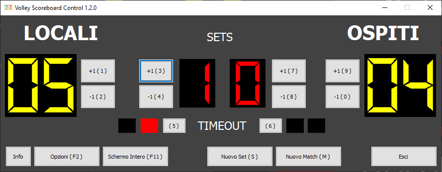
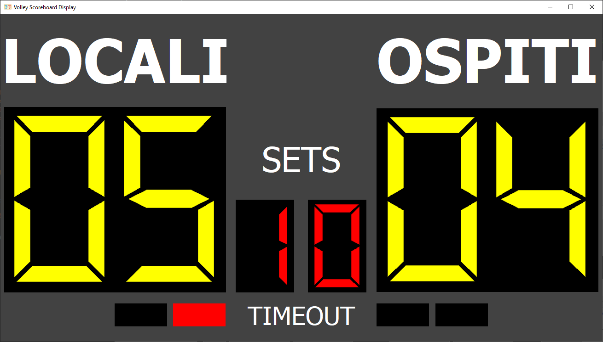
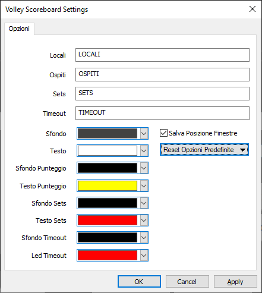

# Volley Scoreboard

Volley Scoreboard is a Windows application which allows to trasform your computer and display in a simple Volley Scoreboard.

It can be used for amateur volleyball associations and amateur tournaments.

Use it with a single display (using shortcuts to change the score) or better with an external tv display or projector changing the score with the control panel. 

#### Control Panel Window
The Control Panel is an intuitive operator console for controlling the scoreboard.
This panel is a separate window that is only visible to the scoreboard operator, so spectators do not see mouse or keyboard input.

#### Display Panel Window
The Display Panel is the main scorebord windows visible by spectators.

#### Settings
Simple settings windos allows yout to customize colors and labels and save Control and Display panel last size and position.

## How to build

To build the application use Visual Studio Community 2017 (free for students, open-source and individual developers).
You only need to open the solution and build the release version.

The project is configured to build a fully statically linked .exe so it doesn't need to be installed and it can be used as portable application.

